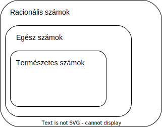

# Számhalmazok

## **Természetes számok halmaza (ℕ)**

> *Definíció:*
>
> Természetes számoknak nevezzük azokat a számokat, amelyekkel megadhatjuk, hogy hány elemű egy halmaz.
>
> A természetes számok halmazát a pozitív egész számok és a 0 alkotják (ℕ = {0, 1, 2, 3, ...}).

Legfontosabb tulajdonságok:
- a legkisebb természetes szám a 0, legnagyobb természetes szám nincs (azaz a természetes számok halmaza megszámlálhatóan végtelen, 0-tól +végtelenig)
- a természetes számok halmaza zárt az összeadásra és a szorzásra, tehát ezek alkalmazásával biztosan természetes számot kapunk.

  Kivonás és osztás is elvégezhető (5-3, 10/2), de ott nem biztos, hogy természetes számot kapunk (5-7, 14/3)!

 

## **Egész számok halmaza (ℤ)**

> *Definíció:*
>
> Egész számoknak nevezzük azokat a számokat, amelyek felírhatók két természetes szám különbségeként.
>
> Az egész számok halmazába a nulla, a pozitív egész számok, és a negatív egész számok tartoznak
(ℤ = {... -5, -4, -3, -2, -1, 0, 1, 2, 3, ...}).

Legfontosabb tulajdonságok:
- nincs legkisebb és legnagyobb egész szám (azaz az egész számok halmaza megszámlálhatóan végtelen, -végtelentől +végtelenig)
- az egész számok halmaza zárt az összeadásra, kivonásra és a szorzásra nézve, azaz ezek alkalmazásával biztosan egész számot kapunk.

  Osztás is elvégezhető (-10/2), de ott nem biztos, hogy egész számot kapunk (14/3)!

 

## **Racionális számok halmaza (ℚ)**
> *Definíció:*
>
> Azok a számokat, amelyek felírhatók két egész szám hányadosaként, racionális számoknak nevezzük.

Példák:
- 145
- 1/2
- -8/9
- 0,25

Legfontosabb tulajdonságok:
- nincs legkisebb és legnagyobb racionális szám (azaz a racionális számok halmaza megszámlálhatóan végtelen, -végtelentől +végtelenig)
- a racionális számok halmaza zárt a négy alapműveletre nézve, azaz a négy alapművelet (+-/*) alkalmazásával ismét racionális számot kapunk.
- minden tört szám felírható véges vagy végtelen szakaszos tizedes tört formában (pl.: 0,25=1/4, 0,3333...=1/3)
- nem minden tizedestört írható fel két egész szám hányadosaként: ezek a végtelen, nem szakaszos tizedes törtek, amik nem tartoznak a racionális számok halmazába (pl.: 0,10100100010000...).

## Hasznos linkek
- [Számhalmazok](http://users.atw.hu/mgvacmatek/Szamhalmazok.pdf)
- [Racionális számok (videó) 13:18](https://www.youtube.com/watch?v=6v9-nWGh9m0)
- [Racionális számok](https://matekarcok.hu/racionalis-szamok/)