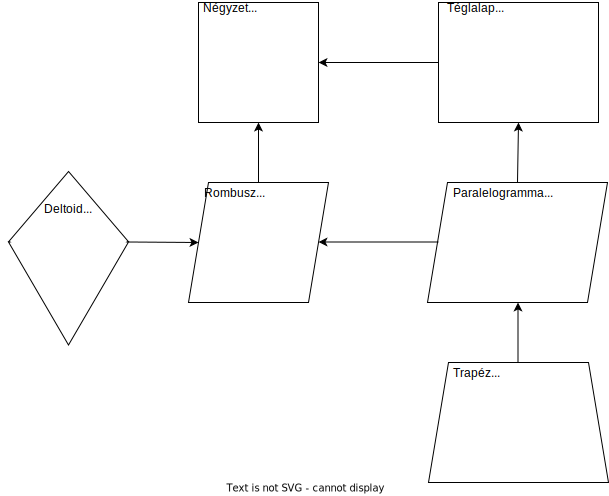

# Síkidomok

 

> *Definíció:*
>
> Ha a síkot egyenes vagy görbe vonalakkal feldaraboljuk, akkor síkidomokat kapunk.
> A határoló vonalak által bezárt síkrész a síkidom területe.
> A síkidomok határoló vonalak szerint lehetnek szabályos és szabálytalan síkidomok.

## Egyenes vonalakkal határolt síkidomok

### Négyszögek

 

## Hasznos linkek
- [**Síkidomok**](http://users.atw.hu/mgvacmatek/Sikidomok.pdf)

